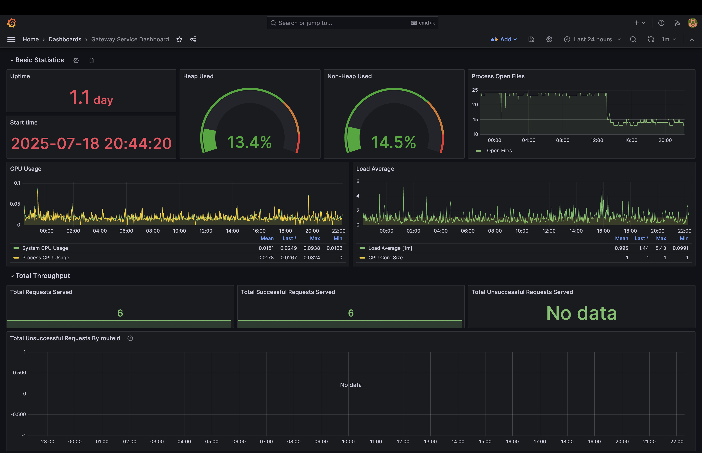

# Recipefy

Recipefy is available at [`https://team-breaking-build.student.k8s.aet.cit.tum.de/`](https://team-breaking-build.student.k8s.aet.cit.tum.de/) (k8s) and deployable via Docker Compose locally.

For running it on docker please see [running-the-application](#running-the-application) and [.env.example](.env.example).

## Project Description

### Application Overview

#### Main Page


#### Recipe Detail View


#### Version Control Interface


#### Recipe History


### Main Functionality

The primary functionality of the application is to enable users to create, fork, and branch recipes in a Git-like collaborative platform. The application allows users to track version history, view diffs between recipe iterations, search semantically using natural language queries, and collaborate on recipe variations. Recipefy combines traditional recipe management with intelligent AI assistance for personalizing and understanding recipes.

### Intended Users

The application is designed for:
- **Home cooks and food enthusiasts** looking to customize or improve recipes
- **Food bloggers and creators** who want to showcase their variations
- **Diet-conscious users** searching for recipes matching their needs (e.g., vegan, gluten-free)
- **Beginner cooks** needing recipe alternatives and guidance

### Integration of Generative AI

Generative AI is integrated meaningfully through a dedicated LangChain-based microservice that provides:

1. **Semantic Recipe Search**: Uses vector embeddings to find recipes based on natural language queries
2. **Recipe Generation**: Creates new recipes with ingredient lists and cooking descriptions

The AI system uses Retrieval-Augmented Generation (RAG) with Weaviate vector store to provide contextually relevant and personalized recipe assistance while maintaining accuracy and relevance.

### Functional Scenarios

1. **Semantic Search**: 
   - User Query: "Easy high-protein breakfast without eggs."
   - AI Response: Retrieves and ranks semantically relevant recipes like tofu scrambles, protein smoothies, or chickpea pancakes.

2. **Forking and Personalizing Recipes**: 
   - User Action: Bob forks a lasagna recipe and modifies it to be gluten-free.
   - System: Tracks changes and makes it discoverable for others with similar preferences.

3. **Branching for Meal Prep**: 
   - User Action: Sarah creates a new branch of her curry recipe for a weekly meal prep version.
   - System: Saves the branch with modified serving sizes and prep instructions, keeping it separate from the original.

4. **Version History Navigation**: 
   - User Action: Tom reviews the past versions of his chocolate cake recipe.
   - System: Displays a timeline of changes with commit messages like "reduced sugar" or "added almond extract."

5. **Tagging and Categorization**: 
   - User Action: Leo tags his new stew recipe as "vegan."
   - System: Adds tags to help users filter and discover relevant recipes.

## Components and Responsibilities (System Design)

### 1. Frontend (React)

**_Responsible Students:_**

- [Ali Taha Dinçer](https://github.com/Subfly)
- [Erhan Varlık](https://github.com/erhanvarlik)
- [İrem Ecem Yelkanat](https://github.com/iremyelkanat)

**Responsibilities:**

- Provide a modern, responsive UI for recipe management and version control.
- Handle authentication with Keycloak via OAuth2/OpenID.
- Display recipe cards, version history, and branching interface.
- Allow users to create, edit, and fork recipes.
- Provide semantic search interface with AI chat integration.

**Core Features:**

- Login with Keycloak SSO
- Recipe management interface
- Version control UI (branching, commits, history)
- AI chat interface for recipe assistance
- Recipe search and filtering
- User profile and preferences

### 2. API Gateway (Spring Boot)

**_Responsible Student:_**

- [Erhan Varlık](https://github.com/erhanvarlik)

**Responsibilities:**

- Route requests to appropriate microservices.
- Handle authentication and authorization.
- Manage CORS to accept request from only allowed origins.
- Provide unified API entry point for all services.
- Expose health checks and monitoring endpoints.

### 3. Recipe Service (Spring Boot)

**_Responsible Student:_**

- [Ali Taha Dinçer](https://github.com/Subfly)

**Responsibilities:**

- Manage recipe CRUD operations.
- Handle recipe metadata and user associations.
- Provide recipe search and filtering capabilities.
- Manage recipe tags and categories.
- Integrate with version control system.

### 4. Version Service (Spring Boot)

**_Responsible Student:_**

- [İrem Ecem Yelkanat](https://github.com/iremyelkanat)

**Responsibilities:**

- Implement Git-like version control for recipes.
- Manage branching operations.
- Track commit history and changes.
- Provide diff viewing capabilities.
- Handle recipe snapshots.

### 5. GenAI Microservice (Python with FastAPI + LangChain + Weaviate)

**_Responsible Student:_**

- [Ali Taha Dinçer](https://github.com/Subfly)

**Responsibilities:**

- Process natural language queries for recipe search.
- Generate and modify recipes using LLMs.
- Implement semantic search using vector embeddings.
- Provide conversational AI interface.
- Integrate with Weaviate vector database for RAG.

**Design:**

- LangChain chains/tools for recipe generation and transformation
- Prompt templates that incorporate user requests and preferences
- Weaviate vector database to store embedded recipes for similarity search
- HuggingFace sentence-transformers for embedding generation
- OpenWebUI integration for LLM inference

### 6. Keycloak Service (Spring Boot)

**_Responsible Student:_**

- [Erhan Varlık](https://github.com/erhanvarlik)

**Responsibilities:**

- Manage user authentication and authorization.
- Handle OAuth2/OIDC flows.
- Manage user profiles and roles.
- Integrate with Keycloak identity provider.

### 7. Databases

**PostgreSQL**: 
- Recipe metadata, user data, version control metadata
- Managed by Recipe and Version services

**MongoDB**: 
- Recipe content snapshots, version history
- Managed by Version service

**Weaviate Vector Database**: 
- Recipe embeddings for semantic search
- Managed by GenAI service

### 8. DevOps

**_Responsible Students:_**

- [Ali Taha Dinçer](https://github.com/Subfly) - Kubernetes DevOps
- [Erhan Varlık](https://github.com/erhanvarlik) - Kubernetes DevOps  
- [İrem Ecem Yelkanat](https://github.com/iremyelkanat) - AWS DevOps, Kubernetes DevOps

**_Responsibilities_**

- Each service is dockerized and has its own image in GitHub registry
- CI/CD pipelines to deploy on student cluster in Rancher
- Helm charts for k8s deployment
- Docker compose for local development
- AWS deployment with Terraform and Ansible

### 9. Monitoring

**_Responsible Students:_**

- [Erhan Varlık](https://github.com/erhanvarlik)
- [İrem Ecem Yelkanat](https://github.com/iremyelkanat)

**Responsibilities:**

- Prometheus metrics collection and visualization
- Grafana dashboards for service monitoring
- Loki and Alloy for log aggregation and request tracing
- Alert management and notification systems

### Communication Flow Example

1. User logs in via Keycloak → JWT token returned.
2. User searches for "vegan pasta recipes" in the UI.
3. React sends search query to API Gateway.
4. API Gateway forwards request to GenAI service.
5. GenAI service performs semantic search in Weaviate vector database.
6. GenAI service generates response using LLM with retrieved context.
7. Response returned through API Gateway to frontend.
8. User selects a recipe and creates a fork.
9. Version service creates new branch and tracks changes.
10. Recipe service stores updated recipe metadata.

### Technologies

| Component       | Technology        |
| --------------- | ----------------- |
| Frontend        | React, TypeScript, TailwindCSS |
| API Gateway     | Spring Boot, Kotlin |
| Recipe Service  | Spring Boot, Java |
| Version Service | Spring Boot, Java |
| GenAI Service   | Python, FastAPI, LangChain, HuggingFace |
| Keycloak Service| Spring Boot, Java |
| Authentication  | Keycloak, OAuth2/OIDC |
| Database        | PostgreSQL, MongoDB |
| Vector Database | Weaviate |
| Monitoring      | Prometheus, Grafana, Loki, Alloy |

## Setup Instructions

### Prerequisites

- Git
- Docker

### Clone the Repository

```bash
git clone https://github.com/AET-DevOps25/team-breaking-build.git
cd team-breaking-build
```

## Running the Application
1. Setup env -- use env.example to setup one
2. Build and start all services:
   ```bash
   docker compose -f docker-compose.yaml up -d
   ```
3. Access the application:
   - Client: [http://localhost:3000](http://localhost:3000)
   - API Gateway Service: [http://localhost:8080](http://localhost:8080)

## Development Workflow

### Client Development

- Built with React + Vite and TypeScript for a modern, reactive UI.
- TailwindCSS for styling with shadcn/ui components.
- Components, routes, pages, hooks, types, and services are organized in the `client/src` directory.
- Features recipe management, version control interface, and AI chat integration.

### Server Development

- Built with Spring Boot for scalable and maintainable server services.
- Includes REST communication between microservices.
- PostgreSQL and MongoDB integration for data persistence.
- RESTful APIs for recipe and version management, with a unified entry point for all services.
- Gradle is used for dependency management and building.
- Source code is in the `server/src/main/java` directory.
- Tests are in the `server/src/test/java` directory.

### GenAI Service Development

- Built with FastAPI for AI-powered recipe recommendations.
- Integrates with OpenAI and local LLMs for generating suggestions.
- Stores embedded recipes in Weaviate vector database for semantic search.
- Source code is in the `genai` directory.
- Tests are in the `genai/tests` directory.

#### GenAI Usage

- The GenAI service is responsible for all interactions with the language model used to generate and modify recipes in Recipefy. It receives user inputs as free-text prompts and responds with structured outputs such as complete recipes, meal plans, or modified instructions. It is implemented using FastAPI, LangChain, and integrates with OpenAI and local large language models.

##### Retrieval-Augmented Generation

- The GenAI service uses Weaviate as a vector store to retrieve relevant recipes before querying the LLM. It adds the retrieved context to the prompt to improve the relevance of answers.

##### Integration

- The client UI sends user requests to the API gateway, which forwards them to the appropriate service. For AI interactions, requests are forwarded to the GenAI service along with the user's query and context. GenAI service then makes a similarity search in the vector database with the given query, and generates a respective answer. (Endpoint: POST - `genai/generate`)

##### Vector Database - Weaviate

We use Weaviate as the vector database to enable semantic search and retrieval-augmented generation (RAG) in Recipefy. Embeddings are generated using HuggingFace's sentence-transformers model.

```python
# Example: Creating HuggingFace embeddings for ingestion
embeddings_model = HuggingFaceEmbeddings(model_name="all-MiniLM-L6-v2")
```

## Kubernetes Deployment

### Deploy with Helm

1. The application is deployable through GitHub Actions with individual CI/CD workflows for each service:
   - Configure SOPS authentication secrets in GitHub repository secrets.
   - Add `KUBE_CONFIG` and `SOPS_AGE_KEY` to GitHub secrets.
   - Each service has its own deployment workflow (e.g., `client-ci-cd.yml`, `recipe-ci-cd.yml`)
   - Run the respective service deployment action with SOPS decryption enabled.
2. Access the application with the cluster URL after successful deployment.

The project includes comprehensive Helm charts for Kubernetes deployment in the `helm` directory. Each microservice has its own Helm chart with proper service discovery, configmaps, and deployment configurations.

### Prerequisites for Kubernetes Deployment

- **SOPS Secret Encryption**: The deployment pipeline uses SOPS to encrypt Kubernetes secret files. The `SOPS_AGE_KEY` must be configured in the GitHub repository secrets to decrypt these files during deployment.
- **Kubeconfig**: A valid Kubernetes configuration file (`KUBE_CONFIG`) must be defined in the pipeline secrets to specify the target cluster.
- **Helm**: The deployment leverages Helm charts to deploy directly to the cluster specified in the kubeconfig, enabling seamless service orchestration and configuration management.
- **Individual Service Workflows**: Each microservice has its own CI/CD pipeline for independent deployment and scaling.


## AWS Deployment

### Deploy with Ansible

1. The application is deployable through GitHub Actions with the following steps:
   - Encrypt env variables with `ANSIBLE_VAULT_PASSWORD`.
   - Add `AWS_SSH_KEY` and `ANSIBLE_VAULT_PASSWORD` to GitHub secrets.
   - Run AWS deployment action with deploy_aws.yml, with the parameters `aws_access_key_id`, `aws_secret_access_key` and `aws_session_token`.
2. Access the application with the link outputted by the action.

### CI/CD Pipeline Workflow

**Triggers:**
- Push to `main` or `feature/**` branches
- Changes in `genai/**`, `server/**`, `client/**`, or workflow files

**Features:**
- **Change Detection**: Uses `dorny/paths-filter` to detect which services have changed
- **Conditional Builds**: Only builds and tests services that have been modified
- **Multi-stage Pipeline**: Build → Test → Docker → Deploy

**Jobs:**
- Identifies which services need building/testing
- Builds and tests services
- Builds and pushes Docker images to GitHub Container Registry
- Deploys to Kubernetes using Helm charts

## API Documentation

REST API documentation for all services is available in the [`api/openapi.yaml`](api/openapi.yaml) file.
Swagger UI is accessible through GitHub Pages at [https://aet-devops25.github.io/team-breaking-build/](https://aet-devops25.github.io/team-breaking-build/)

### Key API Endpoints

#### Recipe Management
```http
GET    /recipes              # List recipes
POST   /recipes              # Create recipe
GET    /recipes/{id}         # Get recipe details
PUT    /recipes/{id}         # Update recipe
DELETE /recipes/{id}         # Delete recipe
```

#### Version Control
```http
POST   /vcs/recipes/{id}/init    # Initialize recipe versioning
GET    /vcs/recipes/{id}/branches # List branches
POST   /vcs/branches/{id}/commit # Commit changes
GET    /vcs/commits/{id}/changes # View diff
```

#### AI Chat
```http
POST   /genai/generate       # Send message to AI
POST   /genai/search         # Semantic recipe search
```

## Requirements

### Functional Requirements

- **Recipe Management**: The system must allow users to create, edit, and delete recipes with rich metadata.
- **Version Control**: The system must provide Git-like branching and commit functionality for recipes.
- **Semantic Search**: The system must allow users to search for recipes using natural language queries.
- **AI Chat**: The user must be able to interact with the application via a conversational interface.
- **Recipe Forking**: Users must be able to fork existing recipes and create variations.
- **Collaboration**: Multiple users must be able to contribute to recipe development.
- **Authentication**: The system must provide secure user authentication and authorization.

### Nonfunctional Requirements

- **Performance**: The system must respond to user queries within 5 seconds in 95% of cases.
- **Scalability**: The architecture must allow horizontal scaling of microservices.
- **Availability**: The system must maintain 99.5% uptime during working hours.
- **Reliability**: In case of failure in any service, users must receive a clear error message.
- **Security**: The system must restrict access to service endpoints and authenticate all users.
- **Modularity**: Each microservice must be independently deployable.
- **Maintainability**: Codebase must follow clean architecture principles and use OpenAPI documentation.
- **Deployability**: The system must be deployable via Docker Compose locally and to a Kubernetes cluster via Helm charts.
- **Observability**: The system must expose Prometheus metrics and provide comprehensive logging.

## Architecture Overview

### High-Level System Architecture


### Application Architecture


### Use Case Diagram


### Analysis Object Model (AOM)


## Monitoring and Observability

Recipefy is equipped with a comprehensive monitoring stack powered by Prometheus, Grafana, Loki, and Alloy, deployed in a Kubernetes environment. This setup enables real-time observability across all microservices.

### Prometheus Configuration

Prometheus is configured to collect metrics from all services every 15 seconds. All services expose Prometheus-compatible metrics:

- GenAI service uses a standard `/metrics` endpoint.
- Server (Spring Boot) services expose metrics via `/actuator/prometheus`.

### Grafana Dashboards

Grafana is used to visualize metrics collected by Prometheus. It is deployed via Helm and configured with:

- Dashboards for all microservices (API Gateway, Recipe, Version, GenAI, Keycloak)
- System-level metrics and infrastructure monitoring
- Contact points for alerting

#### Included Dashboards

- **API Gateway Dashboard**: Comprehensive monitoring of the gateway service including HTTP request rates by endpoint, HTTP status code distribution, request duration percentiles (P95, P99), memory usage, and CPU utilization. Tracks routing performance and gateway health.
  

- **Recipe Service Dashboard**: Monitors recipe management operations including HTTP request rates for recipe CRUD operations, status code distribution, request latency percentiles (P95, P99), memory consumption, and CPU usage. Tracks recipe creation, updates, and retrieval performance.
  

- **Version Service Dashboard**: Tracks version control system performance including HTTP request rates for versioning operations (branching, commits, history), status code distribution, request duration percentiles (P95, P99), memory usage, and CPU utilization. Monitors Git-like operations performance.
  

- **GenAI Service Dashboard**: AI service performance monitoring including HTTP request rates for AI operations (chat, recipe generation, search), status code distribution, request duration percentiles (P95, P99), memory consumption, and CPU usage. Tracks LLM inference times and AI service responsiveness.
  

- **Keycloak Dashboard**: Authentication and authorization monitoring including HTTP request rates for auth operations, status code distribution, request duration percentiles (P95, P99), memory usage, and CPU utilization per pod. Tracks login/logout performance and security event processing.
  

### Logging with Loki and Alloy

Recipefy collects all service logs via Loki and Alloy for centralized logging. This enables log aggregation and visualization through Grafana's built-in log viewer.

#### Example Log Views

**Request Duration Logs**: Monitoring HTTP request performance across services


**Version Control Logs**: Tracking Git-like operations and version management


### Accessing Grafana

- **Production**: [https://grafana.team-breaking-build.student.k8s.aet.cit.tum.de/](https://grafana.team-breaking-build.student.k8s.aet.cit.tum.de/)

**Credentials**: Grafana login credentials can be found in the [Kubernetes secret](https://rancher.ase.cit.tum.de/dashboard/c/c-m-nhcfjg9h/explorer/secret/recipefy-monitoring/grafana-secret#data).

### Alert Management

Alerts are configured using Grafana's Unified Alerting system with comprehensive monitoring of:
- High response times (>5 seconds)
- Error rates exceeding thresholds
- Service health and availability
- Resource utilization


## License

This project is licensed under the MIT License. 